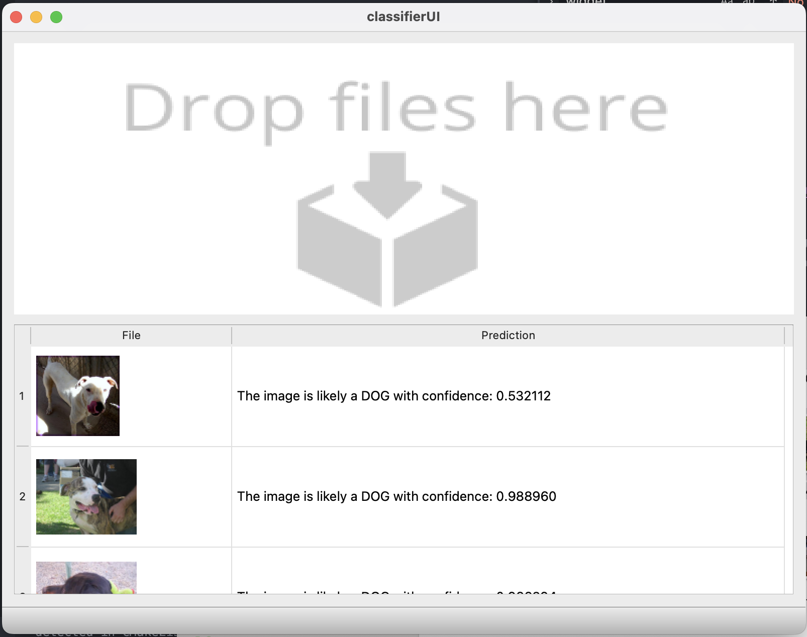

# Dog-Classfier

This is a C++ desktop Dog Image Identification application. 

It uses Neural Network Trained in Python Tensorflow to Determine whether a given image is a Dog or not Dog and the confidence level!

## Build on top of QT UI
QT one of the most popular C++ framework / tools for developing/designing Applications.
You are welcome to develop/try this project on your local machine.

## Rubrics 
- The project demonstrates an understanding of C++ functions and control structures.
- The project reads data from a file and process the data, or the program writes data to a file.(Python CNN Model)
- The project accepts user input and processes the input.( Dropping Images to a drop area)
- Object Oriented Programming Implemented. 4 classes:
  -- ClassifierUI
  -- ImageProcessor
  -- NeuralNetwork
  -- DropArea
- Memory Management:
    -- NeuralNetwork class makes use of the C++ five rules for memory management.

## Instructions

1. Create build folder is not already `mkdir build`

2. cd to build folder `cd build`

3. packaging with `cmake ..`

2. Build the project: `make`

3. Run the resulting executable: `./DogClassifier`
